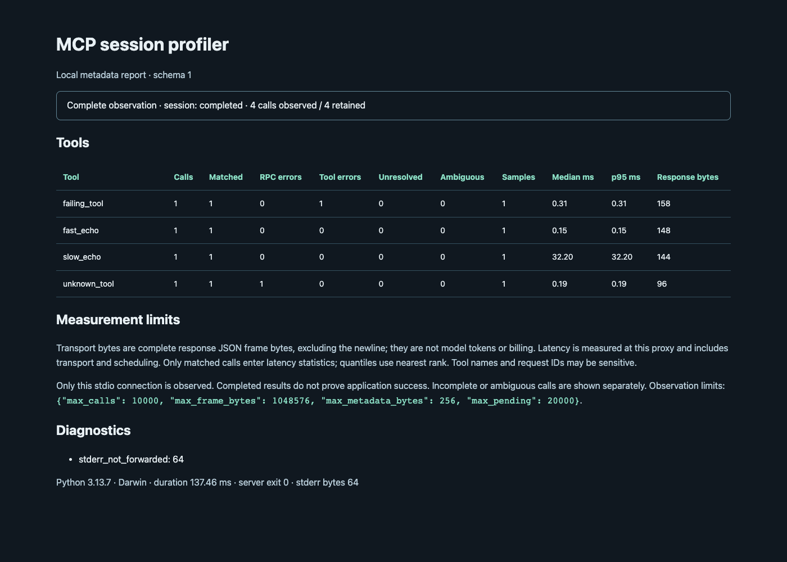

# mcp-session-profiler

[English](README.md)

**看清一次 MCP 会话里实际发生了什么。** 将本地 stdio 代理接在一个 MCP 客户端和一个服务之间，查看哪些工具被调用、哪些慢或报告错误，以及响应有多大。

v0.1 为 **Alpha 首版**，支持 macOS / Linux、Python 3.11+。运行时只用 Python 标准库。代理原样转发协议字节，将有限量的元数据写入本地 JSON；离线 HTML 不依赖 JavaScript、外部资源或网络。



## 跑一次本地演示

```sh
git clone https://github.com/henryli777/mcp-session-profiler.git
cd mcp-session-profiler
python3 -m venv .venv
. .venv/bin/activate
python -m pip install .
python examples/demo.py --output-dir /tmp/mcp-profiler-demo
```

每次使用**新的输出目录**。演示启动本地 fixture，完成 MCP 初始化、工具发现和快速/延迟/失败工具调用，生成 session.json 和 report.html。见[真实执行的本地案例](showcases/local-fixture/README.md)，也可用浏览器打开自己生成的 HTML。

## 接入自己的服务

手动替换 stdio 服务启动命令：

```sh
mcp-profiler run --output /tmp/mcp-session-001.json -- your-server --your-server-option
```

客户端连接代理的 stdin/stdout；`--` 后面是服务的程序和参数，不经过 shell。工具不会自动改客户端配置。在客户端配置中使用绝对路径，每次会话指定新的报告路径；已有文件、符号链接和硬链接会在启动服务前被拒绝覆盖。

连接关闭后：

```sh
mcp-profiler summarize /tmp/mcp-session-001.json
mcp-profiler html /tmp/mcp-session-001.json --output /tmp/mcp-session-001.html
```

`run` 的 stdout 仅用于 MCP 协议。服务 stderr 默认读取后丢弃，只保留字节数；`--forward-stderr` 会将原始文本转发到运行时 stderr，可能包含敏感信息。两种模式均不将 stderr 正文存入报告。

## 指标含义

| 指标 | 含义 |
| --- | --- |
| 调用次数 | 观测到的客户端 `tools/call` 请求；单独显示保留记录数 |
| 延迟 | 代理观测完整请求帧到匹配响应帧的单调时钟耗时，含代理与传输影响 |
| 错误 | 分开统计 JSON-RPC 错误与工具的 `isError: true` |
| 响应字节 | 完整响应 JSON 帧大小，排除换行，包含 JSON 结构 |
| 数据缺失 | 未完成/关联歧义、观测上限、异常帧和不完整会话 |

延迟仅统计成功关联的调用并显示样本数，中位数和 p95 使用 nearest rank。返回结果不等于业务成功。**传输字节不等于 token、模型上下文或账单。** 只观测被接入的一条连接。

关联区分数字 `1` 和字符串 `"1"`，区分客户端/服务端请求来源，支持乱序响应。重复在途 ID 隔离到会话结束，不分配猜测的延迟。批量 JSON 数组原样转发，但不参与调用归属；非法 JSON、非法 UTF-8、超大帧和截断帧均显示诊断。

默认上限：单帧观测 1 MiB、保留 10,000 次调用、20,000 个在途键、工具名/ID 256 字节，转发队列也有上限。可用 `--max-frame-bytes`、`--max-calls`（1–10,000）、`--max-pending` 调整；报告读取上限为 64 MiB。超大帧在传输可行时继续流式转发，标记观测不完整。无法分类的帧会将当前调用标记为歧义，并停止本次会话的后续关联；此前已完成的样本仍有效，后续可识别调用记为未完成。在途键上限耗尽后，本次会话不再接纳新关联键。

客户端输入 EOF 后，服务默认有 3 秒完成响应（`--shutdown-timeout`，0.05–60 秒），慢调用需提高此值。中断或强制退出会清理服务进程组。代理会影响时序，不能保证适配每个客户端的退出行为。

## 隐私

仅保存工具名、保留类型的请求 ID、时间、字节数、数字错误码、结果分类、平台/Python 版本和固定诊断类别。参数/结果正文、错误消息/data、启动参数、环境变量和原始 stderr 均不保存；消息会在内存中临时解析。**工具名和 ID 本身也可能敏感**，分享前请检查。报告文件权限为 `0600`，无遥测和上传。

## 验证与开发

[验证记录](docs/VALIDATION.md)说明官方 Python SDK 工作流、具体版本和实际协议；不代表已验证 Claude Code 或 Codex 客户端。

```sh
python -m unittest discover -s tests -v
python -m pip install 'mcp==2.3.0'  # 仅供兼容性验证，运行时不需要
python examples/sdk_check.py --output /tmp/mcp-profiler-sdk-check.json
```

退出码：`0` 完整观测且保留调用无未完成/歧义；`1` 服务失败；`2` 输入/输出/报告失败；`3` 传输/代理失败；`4` 观测不完整或调用未完成/有歧义；`124` 退出超时；`130` 中断。可行时保存部分报告，写报告失败在 stderr 显示并返回 `2`。

HTTP/SSE、Windows、自动客户端配置、A/B 对比、token 估算和自动调优尚未实现。见[指标约定](docs/MVP.md)、[路线图](ROADMAP.md)、[贡献说明](CONTRIBUTING.md)。

[mcp-tokens](https://github.com/sd2k/mcp-tokens) 和 [mcp-token-audit](https://github.com/michaeltuszynski/mcp-token-audit) 已提供静态 schema 统计，本项目聚焦**真实会话**。初始调研中的历史 [Claude Code issue #29995](https://github.com/anthropics/claude-code/issues/29995) 不证明当前客户端行为或节省效果。

MIT，见 [LICENSE](LICENSE)。
